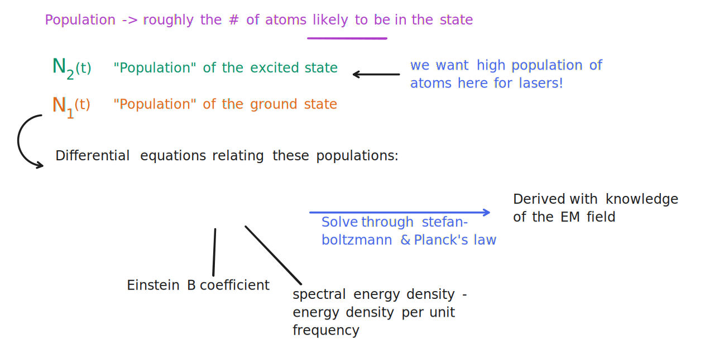

# Lasers and laser physics

As we've covered previously, a key component in our proposed space swarm system is the maser (microwave laser) that transmits the captured energy of sunlight back to Earth. Designing a laser to meet the high demands of our use case is an immense engineering challenge, which we hope to accomplish with research breakthroughs and technological innovation. But before examining the specifics of state-of-the-art laser technology, let us first go over the essential theory behind how lasers work.

## The different types of lasers

Talk about free electron lasers vs traditional lasers. Also mention gyrotrons as a subcategory.

## A review of stimulated and spontaneous emission

We encountered and briefly discussed the phenomenon of **stimulated emission** that underlies lasers, but let us review the topic again to gain greater familiarity for the heavy quantum theory that follows.

Remember that **stimulated emission** is one of two modes of light emission (the emission of photons, i.e. quanta of light). The other, more "conventional" way that atoms emit photons is the process of **spontaneous emission**. This is a three-step process[^1]:

1. An atom absorbs a photon, raising its electron(s) into an upper state with energy $E_2$
2. The electron(s) then decay back to the lower state (or any other lower energy state), which has energy $E_1$. 
3. A new photon is released in the process, with energy $E_\text{photon} = E_2 - E_1$

Spontaneous emission is how most "light" (which includes UV, infrared, microwave, radio wave, etc.) in the universe is produced, from starlight to incandescent lightbulbs[^2]. It has two important characteristics:

- The decay from the upper state to the lower state happens _spontaneously_, without anything to trigger it.[^3] 
- Although the decay rate (probability of a decay) _can_ be predicted, _when_ exactly the decay occurs is **random**.
- The photons that are emitted from the decay travel in random directions and may not have the same frequency as the photon that was initially absorbed.

Unfortunately, spontaneous emission is not helpful for building a laser, because the photon absorbed and the photon emitted may be completely different. Thus the light is not **monochromatic** (monochromatic means that the light is of _only one frequency_), but rather, spread across a wide range of frequencies, and the emitted photons travel away in random directions[^4], meaning that the light is not **collimated** (collimated means that the light comes in parallel rays and forms a tight beam). These two undesirable results defeat the point of a laser (where we want to produce light of a _single frequency_ (i.e. single color) in a tight, one-directional beam).

But there exists an _alternative_ means of light emission, known as **spontaneous emission**. Spontaneous emission is also a multi-step process, but with different steps:

1. An atom is excited by some external energy source. Typically (but not always) this is an applied electromagnetic field. The external energy source raises the atom's electron(s) into an upper state with energy $E_2 = E_1 + hf$, where $f$ is the frequency of the applied EM field
2. The already-excited atom absorbs a photon with energy $hf$, where $f$ is the frequency of the incident photon
3. The electron(s) then decay back to the lower state (or any other lower energy state), which has energy $E_1$.
4. _Two_ identical photons are released in the process, each with energy $hf$

Crucially, stimulated emission is _different_ from spontaneous emission in the following ways:

- The atom is already in an upper state even before a photon strikes the atom, due to the applied electromagnetic field
- This means that _two_ photons are emitted from the decay, unlike in spontaneous emission, where only a single photon is released
- The two emitted photons are _identical_, with the same frequency and direction

We call this process _stimulated_ emission due to the fact that this entire process is _stimulated_ due to the applied electromagnetic field. Since the atom absorbs one photon and emits two photons, the two outgoing photons can then strike _two_ new atoms, which _each_ emit two photons, which is four photons total. This doubling process continues, as four photons becomes eight photons becomes sixteen photons, causing a continuous chain reaction. Even better, the resulting light produced is **monochromatic** and in the **same direction**, which are fantastic for building lasers!

## Operating principles of lasers

After our conceptual review, let us reformulate what we know about light emission and absorption in a more rigorous, mathematical way. Again, we know from the quantum model of the hydrogen atom that electrons can have different states. As each state is an eigenstate of the Hamiltonian, the (non-degenerate) states also have different energies. If an atom absorbs a photon, for instance, the atom can jump from its lower state, which we write as $|1\rangle$, to a higher-energy upper state $|2\rangle$. Meanwhile, an atom can also decay to its lower state by emitting a photon, with the difference in the energies $E_2 - E_1$ between the upper state and the lower state being the energy of this photon. While atoms, in general, have a multitude of states (and more than one upper state), this two-state approximation is good enough for a lot of theoretical analysis. A diagram of the two-state atomic system is shown below:

Precisely _when_ the decay happens is random, and it may occur spontaneously (i.e. without anything external causing it), so we call it **spontaneous emission**. We do know, however, that this process follows a probabilistic law, first derived by Einstein in 1916. Let us assume we are studying a certain group of electrons. Let $N_2(t)$ be the expected number of electrons in a higher energy state $|2\rangle$. Over time, these electrons will spontaneously decay to a lower energy state $|1\rangle$, such that $N_2(t)$ follows the differential equation:

$$
\frac{dN_2}{dt} = -A_{21} N_2
$$

Where $A_{21}$ is called the Einstein A coefficient, and is approximately the probability that an electron will decay from $|2\rangle \to |1\rangle$ per unit time. Remember, this is probabilistic, as in $N_2(t)$ is the _expected_ number of electrons in the upper state, as in, it is _most likely_ that at time $t$ there are $N_2$ electrons that are in the upper state $|2\rangle$. This differential equation is just an exponential decay whose solution is:

$$
N(t) = N_0 e^{-A_{21}t}
$$

Remember that spontaneous emission is fundamentally *random* in nature; they follow general probabilistic rules but those are simply probabilities. But we don't want that, we want emission of photons that we can control. 

For this, we need *stimulated emission*. First, we bring the atom to its upper state by surrounding it with an externally-applied energy source. When this energy source is another electromagnetic field (e.g. flash lamp, arc lamp, sunlight, even an LED) is called _optical pumping_. It is in fact possible to use one laser to optically pump another laser - in fact, this is often the most efficient method of pumping a laser, and can be used to take a laser beam of one wavelength to be able to produce a laser beam of another wavelength.

The wavelength used in optical pumping does not necessarily have to be the same wavelength that is emitted. The chief requirement is that the optical source used in optical pumping matches one of the absorption lines of the atom (or molecule, or molecular gas lasers). For instance, hydrogen absorbs (and correspondingly, also emits) wavelengths of 656 nm (red), 486 nm (cyan), 434 nm (blue), 410 nm (violet), and a variety of other wavelengths in the UV band, among others, as shown below:

But while these absorption lines at the most well-known, they are not its _only_ absorption lines, because, due to fine structure and hyperfine structure (the splitting of energy levels due to  complex quantum effects), other types of transitions are possible, including the 21 cm absorption line (and emission line) in the microwave spectrum.

When an atom has been raised to its upper state by some energy source, a passing photon that has energy $\Delta E = E_2 - E_1$ will _stimulate_ the decay of the atom from its excited-state $|2\rangle$ to its ground-state $|1\rangle$, releasing another further photon of energy $\Delta E$ with the _exact same properties_ as the passing photon. The passing photon that stimulated the transition between the states, however, is _not absorbed_, meaning that now there are _two_ photons of energy $\Delta E$. These two photons can then pass by one atom each, triggering the release of two more photons from each atom, so four photoms after. The process continues, with emitted photons stimulating another atomic transition which would emit another photon, repeating the process over and over to create a cascade of electromagnetic radiation. Thus, we have the laser: an acronym for **light amplification by _simulated emission_ of radiation**. 

Crucially, stimulated emission needs a large population (number of atoms) to be already in the upper state - otherwise, we would see mostly spontanenous emission rather than stimulated emission. Pumping - that is, introducing an external energy source - is what allows stimulated emission to dominate over spontaneous emission, as the population of the upper state is greater than the population of the lower state, which we call a **population inversion**. We may quantify the expected number of atoms $N_2$ in the higher energy state $|2\rangle$ with the following differential equation:

$$
\frac{dN_2}{dt} = -B_{21} N \rho(\nu)
$$

Where $\nu$ is the frequency of the radiation, $\rho(\nu)$ is Planck's law at temperature $T$, and $B_{21}$ is called the Einstein B coefficient (which we'll derive later), which again is a probabilistic measure of decay from $|2\rangle \to |1\rangle$:

$$
\rho(\nu) = \frac{2h \nu^3}{c^3} \left(\exp \left(\frac{h\nu}{k_B T}\right)-1\right)^{-1}
$$

An annotated sketch showing the interrelationships between each of these mathematical relations is shown below:

As an example of how this works in practice, the He-Ne laser, a common type of laser operating in the visible spectrum, uses a mixture of helium and neon gas within an optical chamber. An electrical discharge is created in the chamber between the cathode (positive end) and anode (negative end), which acts as an energy source (laser pump source), causing the gas to become a plasma where the electrons are free to move around. The electrons randomly collide with the helium atoms, transferring energy and bringing the helium to an upper state. The helium atoms also collide with the neon atoms, bringing the neon atoms to an upper state and allowing the helium atoms to decay to a lower state. These atoms in upper states provide the conditions for stimulated emission to occur: when one atom decays to lower states and release a photon, another atom would release another photon by stimulated emission. A reflective mirror at one end of the chamber and a semi-transparent mirror at the end reflects the light back and forth, repeating this process over and over and amplifying the light by re-concentrating energy into the gain medium, ensuring that atoms are raised to the upper state, and continuing the cyle of stimulated emission. At a certain point, this cycle of continuous amplification through stimulated emission has progressed far enough that photons escape the optical cavity and begin to pass through the semi-transparent mirror, which is the laser beam we see.

In a laser, light is fundamentally quantized - that is the prerequisite that allows stimulated emission in the first place. Given that photons are quanta of the electromagnetic field, the full picture of laser dynamics would _in theory_ require a quantum treatment of electromagnetism, that is, quantum electrodynamics. However, the actual quantum-mechanical workings of lasers can be approximately treated as _separate_ from the electromagnetic field produced within it. This means that we can actually describe use _classical_ electromagnetic theory - and specifically the **Gaussian beam** solution to the Helmholtz equation - and use it to derive quantum results. And indeed, this is what we will do.

## Theoretical analysis

**Lasers** are devices that rely on *stimulated emission* to emit light - in fact, LASER is an acronym for "_light amplification by stimulated emission of radiation_". This is in contrast with lightbulbs, stars, or blackbody radiators, which which operate by either stimulated emission or absorption. A laser relies on creating the optimal conditions for spontaneous emission to occur.

Quantum mechanically-speaking, a laser can be classified as a multi-state system that undergoes transitions between its states. This requires more advanced methods compared to time-independent systems, which do not have transitions between states, and therefore have constant probabilities to be in each of their possible states . To analyze lasers, we must use **time-dependent perturbation theory**, where the probabilities of each state _are_ dependent on time. But before we go into time-dependent perturbation theory, let us review the quantum mechanics background required to understand it.

Recall that in quantum mechanics, every system has an associated quantum state, denoted $|\Psi(t)\rangle$. This quantum state is the solution to the time-dependent Schrödinger equation:

$$
i\hbar \dfrac{\partial}{\partial t}|\Psi(t)\rangle = \hat H |\Psi(t)\rangle
$$

Where $\hat H = \hat K + V$ is the Hamiltonian, which is the sum of the kinetic energy operator $\hat K$ and the potential $V$. The allowed energies $E$ of a quantum system, meanwhile, is governed by the time-independent Schrödinger equation:

$$
\hat H |\psi\rangle = E|\psi\rangle
$$

Where $E$ is the energy and $|\psi\rangle = |\Psi(0)\rangle$ is the state at $t = 0$. The state $|\psi\rangle$ is itself a _superposition_ of numerous other states $|\psi_n\rangle$:

$$
|\psi\rangle = \sum_n c_n |\psi_n\rangle
$$

Where each $|\psi_n\rangle$ individually satisfies the time-independent Schrödinger equation equation:

$$
\begin{align*}
\hat H|\psi_1\rangle &= E_1 |\psi_1\rangle \\
\hat H|\psi_2\rangle &= E_2 |\psi_2 \rangle \\
\vdots &\quad \vdots \\
\hat H|\psi_{n-1}\rangle &= E_{n-1} |\psi_{n-1} \rangle \\
\hat H|\psi_n\rangle &= E_n |\psi_n \rangle
\end{align*}
$$

We find that in many cases, the values of $E_n$ take very specific values: such states are known as _bound states_ as they arise when a system is situated within a potential well (such as a Coulomb potential or harmonic potential well). In the well-known case of hydrogen, $E_n$ takes the values:

$$
E_n = \dfrac{\pu{-13.6 eV}}{n^2}
$$

The emission and absorption spectra of hydrogen are based off its values of $E_n$. This is because the energy absorbed or emitted by a hydrogen atom must be equal to the *energy difference* $\Delta E$ between two energy levels. This happens when an electron in a hydrogen atom (or molecule) "jumps" between two orbitals - this can either happen because the atom is excited by an absorbed photon, or an electron releases a photon via either spontaneous or stimulated emission. The energy levels of hydrogen are the simplest of all atoms, but even still, they are diverse:

- Orbital transitions (in atomic hydrogen) generally have a $\Delta E$ in the UV and visible range
- Molecular transitions (in diatomic hydrogen) generally have a $\Delta E$ in the far-infrared range to short microwave range
- Fine transitions have a $\Delta E$ in the millimeter-wave range (which are also microwaves)
- Hyperfine transitions have a $\Delta E$ in the long microwave range

As we can see, the much smaller energy gaps between the latter three types of transitions - which split the energy levels - comprise the majority of the microwave-producing transitions. While an atom (or molecule) can have a large number of states, we are interested in only in transitions that are microwave-producing. We will now cover one of the simplest analytical solutions that corresponds to a real-world maser system: the ammonia maser.

### The ammonia maser

Consider a two-state laser whose gain medium is pumped by an external electromagnetic field. One example is the **ammonia molecule** - ammonia has a [large number of spectral lines](https://www.feynmanlectures.caltech.edu/III_09.html), encompassing [near-UV](https://www.researchgate.net/figure/Ammonia-absorption-cross-section-spectrum_fig4_224107763), [visible light](https://www.researchgate.net/figure/a-UV-vis-absorption-spectra-of-different-concentration-ammonia-in-01-M-Na2SO4_fig3_343588584), [far-infrared](https://www.researchgate.net/figure/Infrared-spectrum-for-ammonia-and-water-vapour-43_fig1_224107763), and [microwaves](https://chem.libretexts.org/Bookshelves/Physical_and_Theoretical_Chemistry_Textbook_Maps/Quantum_Tutorials_(Rioux)/04%3A_Spectroscopy/4.04%3A_The_Ammonia_Inversion_and_the_Maser), coming from electronic (i.e. atomic) transitions, vibrational (molecular) transitions, rotational (also molecular) transitions, among others. However, we are interested in only the transitions that produce microwaves.

Specifically, we consider a specific type of transition called a [umbrella inversion](https://en.wikipedia.org/wiki/Pyramidal_inversion). This transition happens when the nitrogen atom in ammonia transitions from being at the "right" of the molecule to the "left". We can model this as a potential $V(x)$ with two minima, representing each of the two states:

_Diagram courtesy of [LibreTexts](https://chem.libretexts.org/Bookshelves/Physical_and_Theoretical_Chemistry_Textbook_Maps/Quantum_Tutorials_(Rioux)/04%3A_Spectroscopy/4.04%3A_The_Ammonia_Inversion_and_the_Maser)_

Such a system can occupy two states: the lower-energy state, which we will call $|1\rangle$ (represented in the above diagram with the ammonia molecule on the left), and the higher-energy state, which we will call $|2\rangle$ (represented by the ammonia molecule on the right). It is also common to refer to $|1\rangle$ as the **lower state** and $|2\rangle$ as the **upper state**, and we will adopt this naming convention for the rest of this chapter. The general state of the system, assuming that transitions are forbidden (and thus $c_1 = c_2 = \text{const.}$), is given by:

$$
|\Psi\rangle = c_1 |1\rangle e^{-iE_1 t / \hbar} + c_2 |2\rangle e^{-iE_2 t / \hbar}
$$

where $|1\rangle, |2\rangle$ are eigenstates of the system's Hamiltonian assuming no transitions (which we will call $\hat H_0$):

$$
\begin{align*}
\hat H |1\rangle = E_1 |1\rangle \\
\hat H |2\rangle = E_2 |2\rangle
\end{align*}
$$

Now, this is only the case if transitions are forbidden (which is a requirement of time independence) - but we know that transitions between the lower state and upper states do certainly exist. Therefore, we must add time-dependence to the system, which means $c_1, c_2$ must become functions of time $c_1(t), c_2(t)$:

$$
|\Psi\rangle = c_1(t) |1\rangle e^{-iE_1 t / \hbar} + c_2(t) |2\rangle e^{-iE_2 t / \hbar}
$$

Generally, however, these transitions happen randomly, resulting in spontaneous emission, which we don't want for lasers. This means that somehow, we must keep more ammonia molecules in the upper state and less in the lower state, a **population inversion**, for stimulated emission to occur frequently enough that it becomes the dominant mode of light (electromagnetic radiation) production, which is a prerequisite for lasing. 

Let us now examine how to formulate what we have described using the theoretical framework of quantum mechanics. We are primarily interested in stimulated emission, so we will not describe spontaneous emission in this section, although the calculations are actually rather similar. We will use the treatment originating with Griffiths (in _Introduction to Quantum Mechanics_) for this.

Consider an applied electromagnetic field $\mathbf{E} = E_0 \cos (\omega t) \hat k$, where $\omega \equiv 2\pi f$ and $f$ is the frequency of the field. This is a classic (idealized) solution to Maxwell's equations of electromagnetism. The Hamiltonian must then include both the "standard" Hamiltonian $\hat H_0 = \hat p^2 / 2m + V(\mathbf{r})$ as well as the contribution from the electromagnetic field $\hat H_1(t) = -qE_0 z \cos \omega t$, which has a dependence on time due to the EM field. Thus the complete Hamiltonian is given by:

$$
\begin{align*}
\hat H &= \hat H_0 + \hat H_1(t) \\
&= \hat H_0 - qE_0 z \cos \omega t
\end{align*}
$$

The inclusion of the external EM field Hamiltonian is **crucial**. Recall how we previously saw that an applied EM field raises an atom's electrons to an upper state, allowing stimulated emission to occur. The $\hat H_1(t)$ term in the Hamiltonian, also called a **perturbation term**, expresses this fact.

Now, let us assume we have already solved for the eigenstates of $\hat H_0$, and these are given by $|\psi_1\rangle, |\psi_2\rangle, |\psi_3\rangle, \dots$ where $|\psi_1\rangle$ is the lower state and $|\psi_2\rangle, |\psi_3\rangle, \dots$ are the upper states. The eigenstates are orthonormal and thus satisfy $\langle \psi_i |\psi_j\rangle = \delta_{ij}$. The state of the system can be written in terms of these eigenstates as:

$$
|\Psi(t)\rangle = c_1 |\psi_1\rangle e^{-iE_1 t/\hbar} + c_2| \psi_2\rangle e^{-iE_2 t/\hbar} + c_3 |\psi_3\rangle e^{-iE_3 t/\hbar} + \dots + c_n|\psi_n\rangle e^{-iE_n t/\hbar}
$$

Where $c_1, c_2, \dots c_n$ are time-dependent coefficients (also called **transition amplitudes**) whose squared norm $|c_n(t)|^2$ is the probability of finding each eigenstate at time $t$. For simplicity, let's consider a system with only two states: the lower state $|\psi_1\rangle$, which has energy $E_1$, and one upper state $|\psi_2\rangle$, which has energy $E_2$. This may seem like a ridiculous simplification, given that atoms often have dozens of energy levels, but often, the electron transitions relevant to lasers happen only between two energy levels, so this is a _reasonable_ assumption (indeed this is true for the famous ammonia laser[^5]). Then, the state of the system would be given by:

$$
|\Psi(t)\rangle = c_1 |\psi_1\rangle e^{-iE_1 t/\hbar} + c_2| \psi_2\rangle e^{-iE_2 t/\hbar}
$$

Where once again, remember that $c_1, c_2$ are both functions of time. We now aim to solve for $c_1(t)$ and $c_2(t)$, the transition amplitudes. To do so, we plug $|\Psi(t)\rangle$ into the Schrödinger equation $i\hbar \dfrac{\partial}{\partial t} |\Psi(t)\rangle = \hat H |\Psi(t)\rangle$, where, remember, $\hat H = \hat H_0 + \hat H_1(t)$. The resulting expression is rather long:

$$
\begin{gather*}
c_1(t)\hat H_0 |\psi_1\rangle e^{-iE_1 t/\hbar} + c_2(t) \hat H_0|\psi_2\rangle e^{-iE_2t/\hbar} + c_1(t) \hat H_1(t)|\psi_1\rangle e^{-iE_1 t/\hbar} \\
+ c_2(t) \hat H_1(t)|\psi_2\rangle e^{-iE_2 t/\hbar} = i\hbar\bigg[\dfrac{dc_1}{dt}|\psi_1\rangle e^{-iE_1 t/\hbar} + \dfrac{dc_2}{dt}|\psi_2\rangle e^{-iE_2 t/\hbar} \\
- \dfrac{iE_1}{\hbar} c_1(t) |\psi_1\rangle e^{-iE_1t/\hbar} - \dfrac{iE_2}{\hbar} c_2(t)|\psi_2\rangle e^{-iE_2 t/\hbar} \bigg]
\end{gather*}
$$

Which we can slightly simplify (by expanding the brackets) to:

$$
\begin{gather*}
c_1(t)\hat H_0 |\psi_1\rangle e^{-iE_1 t/\hbar} + c_2(t) \hat H_0|\psi_2\rangle e^{-iE_2t/\hbar} + c_1(t) \hat H_1(t)|\psi_1\rangle e^{-iE_1 t/\hbar} \\
+ c_2(t) \hat H_1(t)|\psi_2\rangle e^{-iE_2 t/\hbar} = i\hbar\left[\dfrac{dc_1}{dt}|\psi_1\rangle e^{-iE_1 t/\hbar} + \dfrac{dc_2}{dt}|\psi_2\rangle e^{-iE_2 t/\hbar}\right] \\
\cancel{-i\hbar \dfrac{iE_1}{\hbar}}^{E_1} c_1(t) |\psi_1\rangle e^{-iE_1t/\hbar} - \cancel{i\hbar\dfrac{iE_2}{\hbar}}^{E_2} c_2(t)|\psi_2\rangle e^{-iE_2 t/\hbar}
\end{gather*}
$$

But recall that since $|\psi_1\rangle, |\psi_2\rangle$ are eigenstates of $\hat H_0$, they satisfy:

$$
\begin{align*}
\hat H_0 |\psi_1\rangle = E_1 |\psi_1\rangle \\
\hat H_0 |\psi_2\rangle = E_2 |\psi_2\rangle 
\end{align*}
$$

So, substituting in, we find that the terms actually cancel quite nicely:

$$
\begin{gather*}
\cancel{c_1(t)\hat H_0 |\psi_1\rangle e^{-iE_1 t/\hbar}} + \cancel{c_2(t) \hat H_0|\psi_2\rangle e^{-iE_2t/\hbar}} + c_1(t) \hat H_1(t)|\psi_1\rangle e^{-iE_1 t/\hbar} \\
+ c_2(t) \hat H_1(t)|\psi_2\rangle e^{-iE_2 t/\hbar} = i\hbar\left[\dfrac{dc_1}{dt}|\psi_1\rangle e^{-iE_1 t/\hbar} + \dfrac{dc_2}{dt}|\psi_2\rangle e^{-iE_2 t/\hbar}\right] \\
 \cancel{c_1(t) E_1|\psi_1\rangle e^{-iE_1t/\hbar}} + \cancel{c_2(t) E_2 |\psi_2\rangle e^{-iE_2 t/\hbar}}
\end{gather*}
$$

Meaning that we are left with simply:

$$
\begin{align*}
c_1 \hat H_1(t)|\psi_1\rangle e^{-iE_1 t/\hbar}
&+ c_2 \hat H_1(t)|\psi_2\rangle e^{-iE_2 t/\hbar} \\
&\qquad= i\hbar\left[\dfrac{dc_1}{dt}|\psi_1\rangle e^{-iE_1 t/\hbar} + \dfrac{dc_2}{dt}|\psi_2\rangle e^{-iE_2 t/\hbar}\right]
\end{align*}
$$

Where again $c_1 = c_1(t)$ and $c_2 = c_2(t)$. Since the eigenstates are orthonormal and thus obey $\langle \psi_i | \psi_j \rangle = \delta_{ij}$, if we multiply by $\langle \psi_1|$ on all sides, we would have:

$$
\begin{align*}
c_1 \langle\psi_1|\hat H_1(t)|\psi_1\rangle e^{-iE_1 t/\hbar}
&+ c_2 \langle\psi_1|\hat H_1(t)|\psi_2\rangle e^{-iE_2 t/\hbar} \\
&\qquad= i\hbar\left[\dfrac{dc_1}{dt}\cancel{\langle\psi_1|\psi_1\rangle}^1 e^{-iE_1 t/\hbar} + \dfrac{dc_2}{dt}\cancel{\langle\psi_1|\psi_2\rangle}^0 e^{-iE_2 t/\hbar}\right]
\end{align*}
$$

Which reduces to:

$$
\begin{align*}
c_1 \langle \psi_1| \hat H_1(t)|\psi_1\rangle e^{-iE_1 t/\hbar}
&+ c_2 \langle \psi_1| \hat H_1(t)|\psi_2\rangle e^{-iE_2 t/\hbar}\\
&\qquad= i\hbar\dfrac{dc_1}{dt} e^{-iE_1 t/\hbar}
\end{align*}
$$

We can do some rearranging (dividing by $i\hbar$ and multiplying by $e^{i E_1 t/\hbar}$ on both sides) to get $\dfrac{dc_1}{dt}$ on one side, leaving us with an ODE for $c_1$:

$$
\dfrac{dc_1}{dt} = -\dfrac{i}{\hbar} \left[c_1\langle \psi_1| \hat H_1(t)|\psi_1\rangle
+ c_2 \langle \psi_1| \hat H_1(t)|\psi_2\rangle \right]e^{-i(E_2 - E_1) t/\hbar}
$$

> **Note:** if it is unfamiliar, recall that $\dfrac{1}{i} = -i$

Repeating the same process, only multiplying by $\langle \psi_2|$ rather than $\langle \psi_1|$, gives us an ODE for $c_2$:

$$
\dfrac{dc_2}{dt} = -\dfrac{i}{\hbar} \left[c_2\langle \psi_2| \hat H_1(t)|\psi_2\rangle
+ c_1 \langle \psi_2| \hat H_1(t)|\psi_1\rangle \right]e^{i(E_2 - E_1) t/\hbar}
$$

The system of ODEs for $c_1$ and $c_2$ can be rewritten in matrix form (where here, $\hat H_1 = \hat H_1(t)$ as with before), just as we previously saw in the matrix representation section:

$$
\begin{pmatrix}
\dot c_1 \\[5pt] \dot c_2
\end{pmatrix}
=
-\dfrac{i}{\hbar}
\begin{pmatrix}
\langle \psi_1 | \hat H_1 |\psi_1 \rangle & \langle \psi_1 | \hat H_1 |\psi_2 \rangle \\
\langle \psi_2 | \hat H_1 |\psi_1 \rangle & \langle \psi_2 | \hat H_1 |\psi_2 \rangle
\end{pmatrix}
\begin{pmatrix}
c_1e^{-i(E_2 - E_1) t/\hbar} \\[5pt] c_2e^{i(E_2 - E_1) t/\hbar}
\end{pmatrix}
$$

Let us assume that at time $t = 0$, the atom is in its upper state $|\psi_2\rangle$ with energy $E_2$. Thus the initial condition would be 100% probability of the $|\psi_2\rangle$ state and 0% probability of the $|\psi_1\rangle$ state:

$$
\begin{align*}
c_1(0) = 0, & c_2(0) = 1
\end{align*}
$$

We want to solve for $c_1(t)$, which will give us the probabilities of the atom decaying to the lower state at some future time $t$ (remember, even in stimulated emission, the decay time is random, only the _probability_ of a decay is predictable). The differential equations are indeed quite intimidating to solve. There are, however, some steps we can use to simplify. First, the diagonals of the matrix are often zero; see [this physical argument on Physics SE](https://physics.stackexchange.com/questions/117368/vanishing-diagonal-matrix-elements-of-pertubation) which explains why, which reduces each of the ODEs by one term, so that we "only" have: 

$$
\begin{pmatrix}
\dot c_1 \\[5pt] \dot c_2
\end{pmatrix}
=
-\dfrac{i}{\hbar}
\begin{pmatrix}
c_2\langle \psi_1 | \hat H_1 |\psi_2 \rangle e^{i(E_2 - E_1) t/\hbar}\\[5pt] 
c_1 \langle \psi_2 | \hat H_1 |\psi_1 \rangle e^{-i(E_2 - E_1) t/\hbar} 
\end{pmatrix}
$$

We can then make use of a _perturbative expansion_. Let's first _assume_ that $\dot c_1, \dot c_2$ are small, meaning that transition between the states (including decays) happen relatively infrequently. If the transition rates are small enough, we can assume that $\dot c_2 \approx 0$. If this is the case, then $c_2(t) \approx c_2(0) = 1$. If we substitute this value of $c_2$ into the top ODE of the matrix system (the ODE for $\dot c_1$, we have:

$$
\begin{align*}
\dfrac{dc_1}{dt} &= -\dfrac{i}{\hbar}c_2\langle \psi_1 | \hat H_1 |\psi_2 \rangle e^{i(E_2 - E_1) t/\hbar} \\
&\approx -\dfrac{i}{\hbar}(1)\langle \psi_1 | \hat H_1 |\psi_2 \rangle e^{i(E_2 - E_1) t/\hbar} \\
&\Rightarrow \dfrac{dc_1}{dt} = -\dfrac{i}{\hbar}\langle \psi_1 | \hat H_1 |\psi_2 \rangle e^{i(E_2 - E_1) t/\hbar}
\end{align*}
$$

With this simplification, the ODE becomes solvable - the solution is:

$$
c_1(t) = -\dfrac{i}{\hbar} \int_0^t \langle \psi_1 | \hat H_1| \psi_2 \rangle e^{i(E_2 - E_1) t'/\hbar} \, dt'
$$

> **Note:** This expansion is a _first-order_ expansion, but in theory we can expand to any arbitrary order. The in-depth study of solving time-dependent quantum systems (systems that have some sort of time-dependent Hamiltonian) is known as _time-dependent perturbation theory_; this is just a very introductory treatment.

If we substitute our applied EM field Hamiltonian, which has $\hat H_1(t) = -qE_0 z \cos \omega t$, then the solution (once you perform the integral) is:

$$
\begin{align*}
c_1(t) = \dfrac{i }{\hbar} qE_0\langle \psi_1|z|\psi_2\rangle\dfrac{\sin[(\omega_0 - \omega)t/2]}{\omega_0 - \omega}e^{i(\omega_0 - \omega)t/2}, \quad \omega_0 = \dfrac{E_2 - E_1}{\hbar}
\end{align*}
$$

Taking the squared norm of $c_1$ yields the _probability_ of the transition from the upper state to the lower state, which we will denote $P_{21}$:

$$
P_{21}(t) = |c_1|^2 =  |q\langle \psi_1|z|\psi_2\rangle|^2\left(\dfrac{ E_0}{\hbar}\right)^2 \dfrac{\sin^2[(\omega_0 - \omega)t /2]}{(\omega_0 - \omega)^2}
$$

Note that we can also write this in terms of the _energy density_ of an electromagnetic wave, $u_E = \dfrac{\varepsilon_0}{2} E_0^2$, as:

$$
P_{21}(t) = \dfrac{2u_E}{\varepsilon_0 \hbar^2}|q\langle \psi_1|z|\psi_2\rangle|^2\dfrac{\sin^2[(\omega_0 - \omega)t /2]}{(\omega_0 - \omega)^2}
$$

> **Reminder:** If we know the wavefunction representation of $|\psi_1\rangle, |\psi_2\rangle$, then the inner product becomes an integral, so we have $\langle \psi_1|z|\psi_2\rangle = \displaystyle \int\psi_1^*(\mathbf{r}) z\, \psi_2(\mathbf{r})\, dV$.

We should add one more caveat: this is for a **monochromatic** applied electric field with a strict _linear polarization_. In practice, an applied electric field would be composed of many different frequencies, and would be a mix of different polarizations (for example, sunlight ranges from 300 to 2500 nm and is certainly unpolarized by the time it reaches Earth)[^8]. In that case, instead of a single energy density, we instead have a _spectral energy density_ $\rho(\nu)$, which gives the electromagnetic energy density at frequency $\nu$. Recall again that Planck's law of blackbody radiation tells us that this can be approximated by:

$$
\rho(\nu) = \dfrac{8\pi h\nu^3}{c^3} \dfrac{1}{e^{h\nu/k_B T} - 1} \Rightarrow \rho(\omega) = \dfrac{\hbar \omega^3}{\pi^2 c^3}\dfrac{1}{e^{\hbar\nu/k_B T} - 1}
$$

Where $k_B$ is the Boltzmann constant $T$ is the temperature, and $\nu = \omega/2\pi$. In this case, the more general expression for the probability of the transition via stimulated emission (which we will not derive) is:

$$
P_{21}(t) = |c_1|^2 = \dfrac{\pi}{3\varepsilon_0\hbar^2} |q\langle \psi_1|\mathbf{r}|\psi_2\rangle|^2 \rho(\omega_0)t
$$

Taking the time derivative of the transition probability gives us the **transition rate**, the probability of a transition per unit time. In fact, with the exception of a factor $\rho(\nu)$ to make the units consistent (due to how the Einstein coefficients are defined), this is what we know to be the **Einstein B coefficient**:

$$
B_{21}\rho(\nu) = \dfrac{dP}{dt} = \dfrac{\pi}{3\varepsilon_0\hbar^2} |q\langle \psi_1|\mathbf{r}|\psi_2\rangle|^2 \rho(\omega_0)
$$

And the Einstein coefficients in the rate equations are given by:

$$
\begin{align*}
A_{21} &= \dfrac{\hbar \omega_0^3}{\pi^2 c^3}B_{21}, \\
B_{21} &= \dfrac{\pi}{3\varepsilon_0 \hbar^2}|q\langle \psi_2 | \mathbf{r} |\psi_1\rangle|^2
\end{align*}
$$

From which we may solve the rate equations that govern the population of the $|\psi_1\rangle$ and $|\psi_2\rangle$ states, which, as a reminder, are given by:

$$
\dfrac{dN_2}{dt} = -\dfrac{dN_1}{dt} = -B_{21} \rho(\nu) N_2
$$

Note that the **mean lifetime** $\tau$ of the upper state, meaning the average amount of time an atom spends in the upper state $|\psi_2\rangle$ before decaying into the lower state $|\psi_1\rangle$, can be calculated from the Einstein A coefficient as follows:

$$
\tau = \dfrac{1}{A_{21}}
$$

Of course, this is for just a two-level system (with one upper state and one lower state). Many lasers are three-level or four-level systems, and thus do not have such simple expressions for finding the transition probability. In the most complicated of cases, numerical methods can be used for solving the matrix ODEs to find the transition rates and the rate equations to solve for the population of each state.

### Fermi's golden rule

Our quantum model of lasers is actually just one example in the broader field of **time-dependent perturbation theory**, which describes the dynamics of multi-state quantum systems (like lasers!) Just as we saw at the very beginning of our discussion, time-dependent perturbation theory allows for the possibility of _transitions_ between states. For such a system, we write out a Hamiltonian in the following form, just like we did for analyzing lasers:

$$
\hat H = \hat H_0 + \hat H_1(t)
$$

Where $\hat H_0$ is the **time-independent Hamiltonian**, and $\hat H_1$ is the **perturbation Hamiltonian**, which is responsible for the time-dependent behavior of the system. Fermi's golden rule says that *to first-order*, the **probability of a transition per unit time** $\Gamma_{fi}$ from initial state $|i\rangle$ to final state $|f\rangle$ is given by:

$$
\Gamma_{fi} = \dfrac{2\pi}{\hbar} |\mathcal{M}|^2 \rho(E_f)
$$

Where $\rho(E_f)$ is the **density of states** at energy $E_f$, which we'll explain in a little bit, and $\mathcal{M}$ is called the **matrix element** for the transition, which is given by:

$$
\mathcal{M} = \langle f|\hat H_1|i\rangle
$$

Fermi's golden rule is applicable to a broad range of multi-state quantum systems, from nuclear physics to scattering processes described in quantum field theory (for those interested, $\mathcal{M}$ becomes the first-order term of the S-matrix in QFT). The mean lifetime $\tau$ of the state $|f\rangle$ before a decay to state $|i\rangle$ can also be found from the transition rate $\Gamma_{fi}$ via:

$$
\tau = \dfrac{1}{\Gamma_{fi}}
$$

> **An important note:** What is the density of states, $\rho(E)$? It is just the **number of states per unit energy**. We know that a quantum system has multiple states, and that a system can be in different states depending on the total energy of the system. The density of states is important in measuring the **change in the total number of states** of the system, $\Delta N$, when there is a change in the energy, via $\Delta N = \rho(E) \Delta E$. This means that if you increase (or decrease) the energy by an amount $\Delta E$, the density of states tells you that the corresponding change in the number of states is $\Delta N$. In the continuous limit, this becomes $dN = \rho(E) dE$, or $\rho(E) = \frac{dN}{dE}$, at which point physical intuition can fail, but the math stays the same. Note that in some applications, it is customary to write the density of states averaged over the _total volume_, that is, $\rho(E) = \frac{1}{V} \frac{dN}{dE}$, but in Fermi's golden rule we use the form $\rho(E) = \frac{dN}{dE}$.

Using the transition rate, one may then find the following differential equation relating the population $N_i$ of state $|i\rangle$ with the population $N_f$ of the state $|f\rangle$, which are simply the exponential decay/growth equations, _assuming_ that there are no other transitions than the transition $|i\rangle \to |f\rangle$:

$$
\begin{align*}
\dfrac{dN_i}{dt} &= -\Gamma_{fi} N_i \\
\dfrac{dN_f}{dt} &= \Gamma_{fi} N_f
\end{align*}
$$

This looks very similar to the laser rate equations for a two-level system! And indeed, that is correct! In our case of lasers, $\Gamma_{fi}$ is $A_{21}$, the Einstein A coefficient, and therefore $\tau = 1/\Gamma_{fi} = 1/A_{21}$ is the lifetime of the upper state. Our entire process of finding $c_1(t)$ and $c_2(t)$ and calculating the transition probability $P_{21}$ could have been avoided, had we used Fermi's golden rule directly. It is a _very_ powerful tool to use when doing calculations.

## Laser mechanics

Up to this point, we have covered the following principles of how lasers work:

- A laser requires some sort of power source (usually an applied EM field) to bring the atoms (or ions or molecules, etc.) in some material to an upper (higher-energy) state (we call this **laser pumping**)
- Once the laser is in this state, any incident photons lead to the emission of two more photons
- The two photons start a chain reaction that leads to the exponential emission of monochromatic, coherent, strongly-directional light (or other form of EM radiation)

We now introduce some technical terminology. A laser is typically composed of an energy source as well as a (nearly) completely-sealed cavity, filled with some material, called the laser cavity (or _optical cavity_). The material is known as the **gain medium** or **lasing medium**[^9]; the atoms of the gain medium are excited by the energy source and emit light. Gain media (_media_ is plural of _medium_) can be anything from a solid (e.g. crystalline solid), liquid solution (e.g. organic dyes), or gas (e.g. hydrogen/argon/carbon dioxide gas)[^6]. The gain media is then pumped with energy from the laser's power source; typically, this is either a strong electric current, a very, very bright light (which is an EM field, since light is an EM wave), or another laser (which, again, is also an EM field). 

To keep as many of the atoms as possible in the upper state, which is necessary for stimulated emission, the laser cavity has mirrors at its ends, which reflect the light back and forth throughout the material, continuously re-injecting energy back through the gain medium. When more than 50% of the atoms within the gain medium are in their upper state[^7], we say that a **population inversion** has occured. At this point, stimulated emission takes over, causing the chain reaction that leads to a rapid emission of more and more photons. One end of the laser cavity is a semi-transparent mirror[^10] that is designed to let a small fraction of the light through, while the rest of the light reflects off to continue the stimulated emission process inside the cavity. This mirror is often called an **output coupler**. The light that makes it through the output coupler forms the characteristic beam that emerges from one end of the laser.

The four main components of a laser - power source, gain medium, laser (optical) cavity, and output coupler[^11] - are each complex topics in and of themselves, and especially for high-performance lasers, each requires meticulous design and engineering. Lasers fine-tuned to specific tasks often have different requirements for the type of beam, wavelength/frequency, and power efficiency of the laser. Hence, we will discuss lasers in _much greater depth_ in the following sections.

### Lasing transitions and the gain medium

When designing a laser, we first want to consider the material composition of the gain medium. The gain medium could be composed of elemental atoms, ions, molecules (like the ammonia molecule used in the ammonia maser), crystals, semiconductors, or even a combination of different materials. For this reason, we will use the generic term "quantum system" to represent the atomic/molecular/ionic/etc. constituents of the laser's gain medium, instead of specific terms like "atom" or "molecule".

#### Finding the states

First, we want to identify all the states of the quantum system. This is done by solving for the states of the quantum system with the _time-independent part_ of the Hamiltonian. Just as we showed earlier in performing our calculations for the ammonia maser, if we let the total Hamiltonian of the system be $\hat H = \hat H_0 + \hat H_1(t)$, where $\hat H_0$ is the time-independent portion and $\hat H_1(t)$ is the time-dependent portion, then the states $|\psi_n\rangle$ of the system are found by solving the time-dependent Schrödinger equation:

$$
\hat H_0|\psi_n\rangle = E|\psi_n\rangle
$$

Depending on the system's complexity, an analytical solution may be possible to find (for instance, in the case of the hydrogen atom) or be impossible to find (for instance, in the case of all multi-electron atoms). This step therefore may often require using approximations or numerical methods to calculate the states and find the energy eigenvalues, from which we may obtain the emission spectrum (all the wavelengths the system can emit light).

#### Selection rules

Next, we want to find the _possible transitions_ between different energy states. This involves the selection rules. A selection rule defines which transitions between states are possible and which transitions are impossible in a quantum multi-state system. A transition between two states $|\psi_m\rangle \to |\psi_n\rangle$ is said to be **allowed** _if_ the quantity $\langle \psi_m |\mathbf{r} |\psi_n\rangle$, called the _matrix element_, satisfies:

$$
\langle \psi_m |\mathbf{r} |\psi_n\rangle \neq 0
$$

However, if $\langle \psi_m |\mathbf{r} |\psi_n\rangle = 0$, a transition is said to be **forbidden**. For instance, the states of the hydrogen atom, which are parametrized by three quantum numbers ($n$, $m$, and $\ell$) and which we write as $|\psi_{m, n, \ell}\rangle$, satisfy the following selection rules:

$$
\begin{align*}
\langle\psi_{m, n, \ell}|\mathbf{r}|\psi_{m', n', \ell'}\rangle = \begin{cases}
\text{nonzero}, & m' =m \text{ and } l' = l \pm 1, \\
0, & \text{otherwise}
\end{cases}
\end{align*}
$$

In theory, we must compute the matrix element $\langle \psi_m |\mathbf{r} |\psi_n\rangle$ for all the possible combinations of states $|\psi_m\rangle$ and $|\psi_n\rangle$ to find all possible transitions; in practice, if the states of a quantum system already satisfy certain orthogonality relations, we can quickly tell which matrix elements are zero, and therefore which transitions are allowed or forbidden.

#### Identifying transitions

Next, we need to sort through all the allowed transitions to identify the _ideal transitions_.
Atoms usually have many different possible radiative transitions (also called _decay modes_, "radiative" means that the transition leads to a photon being emitted), so we want to find the _best decay modes_. A decay mode is ideal when all the below conditions are satified[^12]:

1. The transition wavelength of the decay mode corresponds with the desired wavelength of the laser light. For instance, you would look for transition wavelengths between 780nm-2500nm if your target wavelength for the laser is in the near-infrared range.
2. It should be easy to create a population inversion. In practical terms, it means that the transition rate (probability of a transition per unit time) of stimulated emission should be much higher than the transition rate of spontaneous emission in the system.
3. The upper state in the decay mode should have a generally long lifetime $\tau$, so that the quantum system maintains a higher population in the upper state compared to the lower state (which again is what leads to a stable population inversion)
4. The lower state in the decay mode should be quickly depopulated by some mechanism[^13], so that the quantum system always maintains as low a population as possible in its lower state. This depopulation mechanism should be non-radiative (meaning it doesn't involve releasing a photon), instead causing the lower state to decay by some other means, like the [emission of a phonon](https://www.rp-photonics.com/multi_phonon_transitions.html) (a type of structural vibration) for solid gain media.
5. The decay mode can lead to another decay, meaning that the system in the lower state can decay to an even lower state. This requires that the lifetime of the lower state is not too long, and that it has allowed transitions (by the selection rules) with a high transition probability to decay to another state. Multiple decays allows building _multi-level_ lasers, which have many advantages over two-level lasers (lasers that use a transition from only one upper state to the ground/lower state)

Nearly all of these conditions can be checked against with (tedious) calculations. The transition wavelength comes from calculating the energy eigenvalues associated with each of the states of the system. Using the energy eigenvalue expression $E_j = \langle \psi_j |\hat H|\psi_j\rangle$, which we learned from the section on the matrix representation of operators, we can write the transition wavelength for a transition from upper state $|\psi_m\rangle$ to lower state $|\psi_n\rangle$ as follows:

$$
\lambda_{mn} = \dfrac{hc}{|E_m - E_n|} = \dfrac{hc}{\left|\langle \psi_m|\hat H_0|\psi_m\rangle - \langle \psi_n|\hat H_0|\psi_n\rangle\right|}
$$

From calculating all possible transition wavelengths for the allowed transitions, we can build up the **spectrum** of the system, giving all the wavelengths of light that the system can (theoretically) emit. We need to then filter the transitions by our other conditions. The transition rates $\Gamma_{fi}$ for stimulated and spontaneous emission can be calculated using Fermi's golden rule the same method we outlined for the ammonia maser, from which we may easily obtain the lifetime $\tau$ of the upper state with $\tau = 1/\Gamma_{fi}$, as we mentioned earlier. Multi-level decays can be checked with the selection rules' matrix elements $\langle \psi_m |\mathbf{r} |\psi_n\rangle$ as well as further computation of transition rates.

#### Identifying materials

In the case of **optically-pumped lasers** (and masers), we also need the gain medium to absorb light strongly around the chosen laser wavelength. This is not an issue for lasers that use atoms of a single element as their gain medium, as those have identical emission and absorption spectra. This _is_ an issue for lasers that use a mixture of different atomic species or molecules (_species_ means the same as "type"), and especially for solid-state lasers that use a combination of solids (usually crystals) with ions of a different element packed into their crystal lattice. In such materials, one of the species is typically the one that absorbs light and quickly decays to a lower energy state, triggering additional decays in the next species. For solid-state lasers in particular, the species responsible for light absorption is typically the solid, which (again) is typically a crystal such as $\ce{Y3Al5O12}$ (yttrium aluminum garnet) or $\ce{LiYF4}$ (yttrium lithium fluoride).

### Three and four-level systems

The ammonia maser, which we've been analyzing, is a _two-level laser_. Unfortunately, it is not a very practical laser, and emits miniscule amounts of power in its microwave beam. This is all to do with the fact that it operates as a **two-state system**, where we have only one upper and one lower state.

In a two-state system, any atom (or ion or molecule) that decays from the upper state must necessarily increase the population of the lower state. But a laser operates by achieving a population inversion, where the upper state has a greater population than the lower state, so we need to constantly boost the atoms back into the upper state using our pump source. This _can_ theoretically be done, but uses a lot of energy. A good analogy, which we borrow here from the textbook _Physical Chemistry_ from Libretexts[^14], is reversing the flow of water in a waterfall; while possible, it is incredibly energy-consuming and inefficient.

Any form of pumping can only establish a _thermal equilbrium_ between the two states, where the population $N_2$ of the upper state and the population $N_1$ of the lower state are equal, that is, $N_1 = N_2$. Thus, $N_2/N_1 = 1$, which cannot create a population inversion, since a population inversion is created (by definition) when the population of a upper state $N_j$ and the population of a lower state $N_i$ satisfies $N_j/N_i > 1$. The ammonia maser gets around this issue by not using a pump source at all; it uses an electric field to separate ammonia molecules that happen to naturally be in the higher-energy state from those of the lower-energy state, using the fact that they have different angular momenta. Unfortunately, it also means that it outputs very little power. We can also get around this issue by running the laser in _pulses_, so that there is not enough time for thermal equilibrium to develop, and we can immediately pump more energy after each pulse to raise the population of the upper level. But it is **impossible** to make a pumped two-level laser (or maser) operating continuously - you either need to give up continuous operation and make the laser pulsed, or give up pumping and end up with a very weak laser/maser beam.

So it should come as no surprise that almost all lasers are either three-level lasers or four-level lasers. The most efficient lasers, particularly for continuous operation, are four-level lasers.

[^1]: https://www.rp-photonics.com/spontaneous_emission.html
[^2]: https://ecampus.matc.edu/mihalj/scitech/unit5/incandescence/incandescence.htm
[^3]: Technically speaking, the emission of a photon from the state transition (decay from the upper state to a lower state) _doesn't_ happen completely on its own. The quantum electrodynamical vacuum is what mediates the transition and thereby the release of a photon, but that is an advanced topic we'll cover in the expert guide
[^4]: https://physics.stackexchange.com/questions/338038/why-laser-is-a-collimated-parallel-beam?rq=1
[^5]: https://www.britannica.com/technology/ammonia-maser
[^6]: https://en.wikipedia.org/wiki/List_of_laser_types
[^7]: https://en.wikipedia.org/wiki/Stimulated_emission#Optical_amplification
[^8]: https://www.sciencedirect.com/topics/physics-and-astronomy/solar-spectra
[^9]: https://en.wikipedia.org/wiki/Optical_cavity
[^10]: https://en.wikipedia.org/wiki/Output_coupler
[^11]: https://commons.wikimedia.org/wiki/File:Laser.svg
[^12]: From RP Photonics Encylclopedia, https://www.rp-photonics.com/laser_transitions.html
[^13]: From RP Photonics Encylclopedia, https://www.rp-photonics.com/lower_state_lifetime.html
[^14]: _Physical Chemistry_, Libretexts, [Chapter 15.3](https://chem.libretexts.org/Bookshelves/Physical_and_Theoretical_Chemistry_Textbook_Maps/Physical_Chemistry_(LibreTexts)/15%3A_Lasers_Laser_Spectroscopy_and_Photochemistry/15.03%3A_A_Two-Level_System_Cannot_Achieve_a_Population_Inversion)