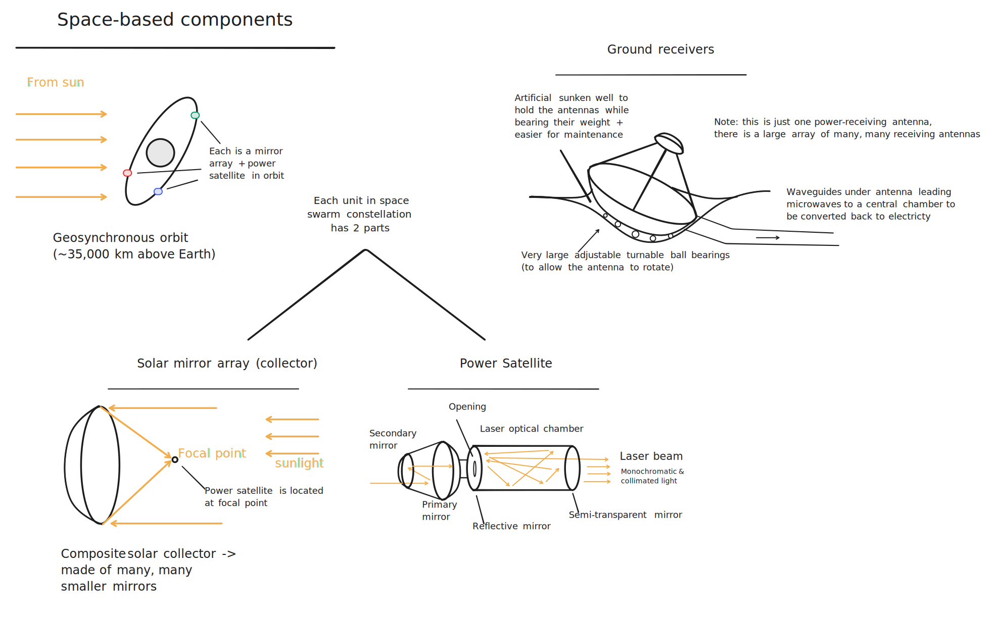
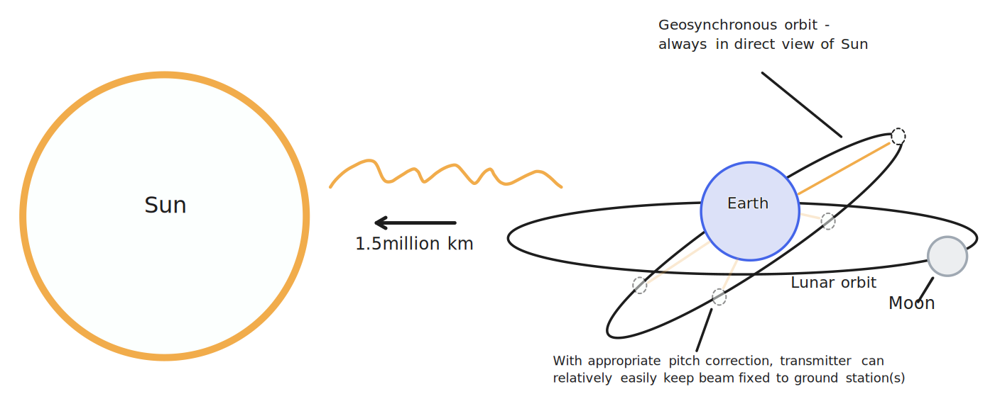
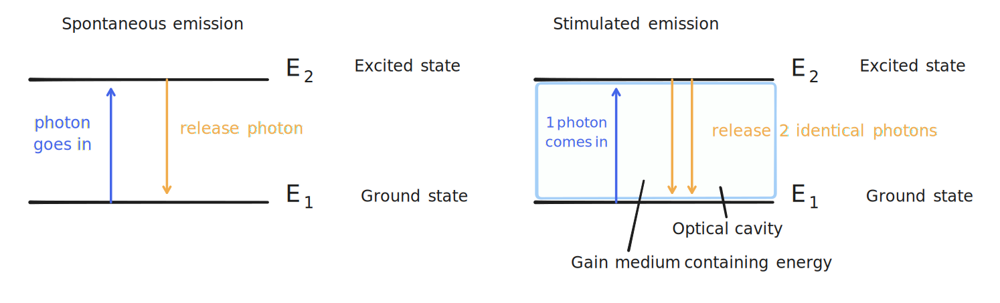
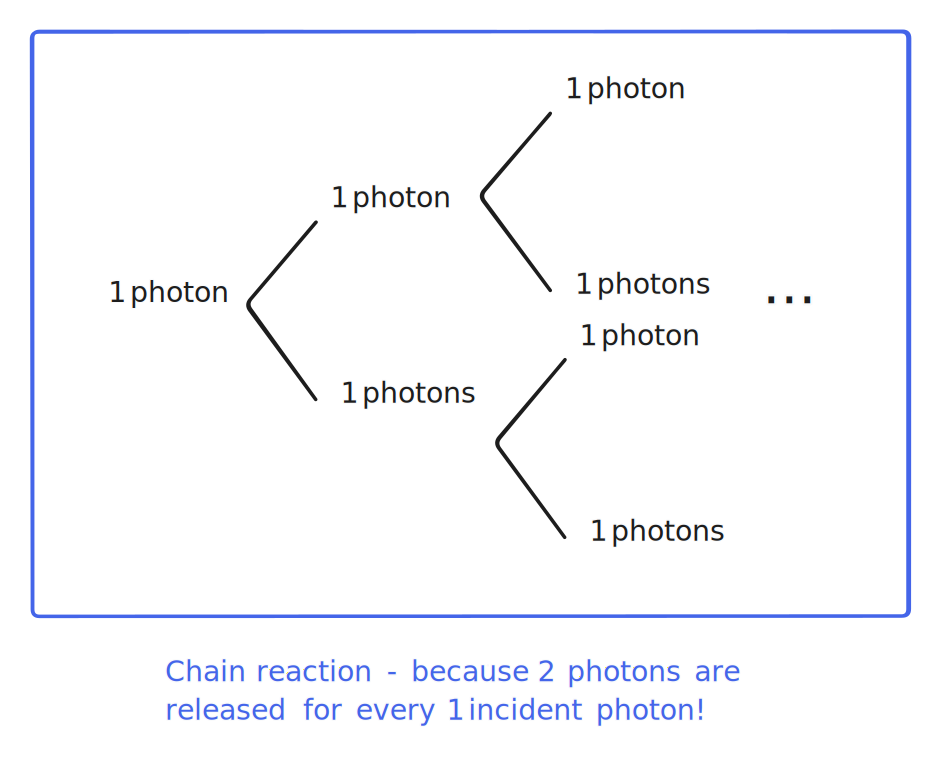

# Conceptual design

With all the mathematics and physics prerequisites covered, we can now introduce our proposed design for the space swarms. This section involves minimal mathematics, and is primarily a conceptual overview of the whole system that does not go into too much detail on the physics or engineering.

The system captures solar energy with with a massive solar collector array. We borrow an idea dating back to the time of Archimedes, but upgraded to the space age: using lots of curve mirrors that together form a giant reflector that focuses sunlight to a single point, something we can already do on Earth with [impressive results](https://youtu.be/TtzRAjW6KO0). We then convert sunlight to microwaves, using the sunlight to optically pump powerful microwave lasers that transmit the power down to Earth. We use star-tracking and ground-tracking technology and a constellation of satellites to guarantee 100% coverage of the sky and 24-hour microwave transmission in all weather conditions to our terrestrial receiver stations. These stations use giant sunken parabolic antennas to receive the power, which can then be converted straightforwardly to electricity. We thought it might be easier to explain the system with a diagram, so here it is:

We will dive deep into each aspect of the system, as described on the diagram, in the following sections.

## Choice of wavelength

Our first design consideration is the wavelength of the light we use to transmit power we collect from space down to Earth. While it may seem obvious that visible light is a terrible choice, let us re-review the reason why.

 The primary issue that makes visible light highly unsuitable is _atmospheric attenuation_. Earth's atmosphere does not allow all wavelengths of light to pass through equally. The below plot of atmospheric opacity - that is, how much of each wavelength of light passes through the atmosphere - showcases this issue very clearly (source: Wikipedia):

Visible light is partially absorbed by the atmosphere in even the best of conditions; when considering stormy weather, clouds, rain, and other atmospheric obstructions, visible light is very ineffective for energy transfer. Infrared does not fare much better (in fact, it is actually much worse!), and neither do the shorter wavelengths of light like ultraviolet and X-rays, which we would not use anyway as they are ionizing radiation and dangerous. That leaves us with just microwaves and short to medium-wavelength radio waves, but the longer wavelengths of radio waves as compared to microwaves means that they need larger receiver antennas (we will cover why when we discuss antenna theory). Having eliminated all the other options, it becomes apparent that microwaves are our best bet.

## Concentrating sunlight

To concentrate solar energy - that is, sunlight, which is primarily in the visible range, with some ultraviolet and near-infrared - we use lots of space-based mirrors that together form a **paraboloid**. Recall that a parabola is a curve in the form $y = kx^2$. A paraboloid is simply a surface of revolution formed by rotating a parabola about the x-axis:

A parabola has the special property that all points along it are equidistant from a special point known as the **focus** and a special vertical line known as the **directrix**, see the below diagram:

This means that parallel lines converge on the focus, which is useful for directing plane waves of light to the focus, allowing a reflector shaped as a parabola to act as a solar energy concentrator. For a parabola that opens up along the y-axis, given by the function $y = x^2 / 4a$, where $a$ is a constant, then $(0, a)$ is the location of the focus, and $y = -a$ is the equation of the directrix. We call $a$ the **focal length**, and it is the point at which all parallel rays directed at the parabola converge. Due to this property, all light incident on the parabolic reflector would be concentrated at the focus, producing a region of extremely concentrated energy. In fact, this is enough concentrated energy that portable parabolic reflectors are used in some regions of the world as a heat source for cooking, and need only a sunny day to reach temperatures of up to 400 degrees Celsius (source: Wikipedia). 

Geometrically, our design shares the same basic properties, only we would be doing this in space, with heliostats (smaller individual mirrors) that together form a space-based composite parabolic reflector to focus sunlight. The combined surfaces of the smaller mirrors acts as one very large parabolic reflector with a very large total collection area. The below image of heliostats, while not of a design that forms a composite _parabolic_ reflector, does give a sense of the projected layout:

Theoretically speaking, the more heliostats, the better, but due to practical considerations regarding the cost of launches, the first prototypes might have to make do with only a few heliostats, or alternatively, many but small heliostats. That is no issue, however; with time, we can always add more, after all, over many launches.

## Orbital placement

With the basic design of the solar mirror (i.e. composite parabolic collector) settled, we must now choose a suitable placement for its location, along with the power satellites that house the lasers to transmit the power back to Earth. Our proposed orbit is called a _geosynchronous orbit_ (GSO). To understand geosynchronous orbits, we must first understand _geostationary orbits_. A geostationary orbit is a circular orbit around the Earth where the satellite orbits at just the right radius to complete one full orbit in the same time as one revolution of Earth (that is, one day). This means that any satellites placed in geostationary orbit can each track one point on Earth continuously, making them highly useful for telecommunications and broadcasting.
 
  A geosynchronous orbit is similar to a geostationary orbit in that it matches Earth's rotation, but different in that instead of placing transmitting satellites at the same place above the equator, we place the collector and transmitting satellite together in an eccentric (angled) and elliptical (ellipse-shaped rather than circular) orbit, as shown in the figure below:
  

This configuration allows the collector and transmitting satellite to always be facing in full view of the Sun, unlike a geostationary orbit where the Earth blocks out the Sun for a significant duration of the orbit, while requiring minimal tracking. Due to its high eccentricity (i.e. going above and below Earth's orbital plane), it also mostly avoids the issue of the Moon blocking out light. The only exception would be when the satellites pass the ecliptic (Earth orbital plane) when the Moon is at a point in its orbit where it is exactly between the satellites and the Sun, but this is easily countered by simply having a pair (or even constellation) of collectors and transmitters at opposite ends of the same orbit. Finally, this orbit is very well-understood and a stable orbit, so much so in fact that there is an analytical expression for it.

The one difficulty with a geosynchronous orbit, other than its sheer distance from the Earth, is that each laser on the power satellite must be attached to a gimbal mount so as to track different ground stations receiving power as the Earth rotates, and an automated computer system must switch between different power beams as one station passes out of view and another comes into view. This is because while the satellite always stays at the same _longitude_ with respect to the Earth, its _latitude_ continuously varies, so we must implement a station tracking system. As a reference for a similar existing system, this is a diagram showing the coverage of the three respective stations used for NASA's Deep Space Network (credit: NASA):

In our case, each of the ground stations is designed to be able to track the power beams across the sky, ensuring complete coverage. The transmitter satellites must coordinate with the ground stations in keeping the beam accurately focused to higher than GPS precision as the Earth rotates. This complicates the already highly-complicated task of keeping a beam almost perfectly collimated (that is, making sure the beam travels in parallel rays) over immense distances, as any vibrations or misalignment of the mount could mean overshooting or undershooting the ground stations by hundreds of meters or even kilometers.

## Transmitting power to Earth

After collecting solar energy in deep space, we have to get the energy to earth in some way. This consists of two parts: the power satellite in space, and the receiver stations on Earth. In space, a power satellite is placed at the focus of the composite solar mirror, where the sunlight collected by the mirror is concentrated. The power satellite has a set of two mirrors facing the concentrated sunlight, a primary and a secondary mirror, to redirect the light inside the power satellite.

Here, the light enters into a chamber - the optical cavity of a laser, and it is used to optically pump a (or several) microwave lasers (masers) - lasers but with microwaves instead of visible light. This optical cavity is where the energy of the concentrated sunlight is converted into a powerful microwave beam.

A maser - as with any laser - works by the principle of **stimulated emission**, which we will briefly review. Recall that in quantum mechanics, an atom is allowed to only take certain _states_. Each state corresponds to different momenta, different probabilities of occupying different locations in space, and crucially, different **energies**. Thus, we speak of _energy levels_ in an atom, each energy level being a particular energy of a given state. If this is unfamiliar, feel free to re-read the subchapter on quantum mechanics, which we went through earlier in this chapter.

Consider an atom with two primary energy levels, which are each associated with a given state. These two states are the _ground state_, which is the lowest-energy state, and an _excited state_, which has a higher energy. Let us call the energy of the ground state $E_1$, and the energy of the excited state $E_2$. When an atom _absorbs_ a photon, the energy of the photon is transferred into the atom, causing it to "jump" from the ground state to the excited state. **Stimulated emission** is one of two modes that allow atoms to change state (which we call an _atomic transition_), the other being **spontaneous emission**. Conventionally, atoms in an excited state transition back to the ground state through spontaneous emission, where the atom randomly emits a single photon of energy $\Delta E = E_2 - E_1$ without any external input. Thus, we say that it is a _spontaneous_ (i.e. random) process. **Stimulated emission**, by contrast, requires that a photon pass towards an excited atom, triggering the transition and releasing a photon _identical to the received photon_. The incident (passing) photon is not absorbed by the atom, so we have a combined total of _two_ photons released. Each of those two photons can stimulate other atoms, leading to a rapid emission of _identical_ photons that gives lasers their monochromatic (i.e. single-frequency light) and beam-like character. We illustrate this in the diagram below:

Note that stimulated emission occurs predominantly when atoms are _raised to a higher-energy state_ by some external energy source. In our case, the mirror-focused sunlight is our energy source, which is used to optically-pump (i.e. force energy into) atoms within the laser cavity. This powers our maser beam, which transfers the energy of the concentrated sunlight into microwaves that can be readily converted to electricity on Earth.

## Receiving power

As well as solar space mirrors to capture solar energy and power satellites to transmit it down to Earth, the system also needs ground-based receiver stations to receive the power from space. Each receiver station is composed of an array of large parabolic antennas housed in rotatable semi-sunken platforms. This allows them to each capture some portion of the power beam, then combine their beams together through waveguides that channel microwaves into one central hub. This allows the entire array to effectively act as one antenna, without requiring a single unrealistically-massive antenna.

Each parabolic antenna is designed to be a scaled-up version of traditional radio and telecommunication antennas, only with far more advanced tracking technology to stay in perfect alignment with the power satellites orbiting overhead, and strengthened design to be able to accomodate much-higher power microwaves. This means that the parabolic antennas, while complex in engineering terms, are not too different from traditional parabolic antennas in the sense that they share the same physics. We will cover the details of how to do antenna analysis and apply antenna theory later within this chapter.

## More details

This introduction is meant to only be an entry-level description of our system. Each component of the system is described by complex physics and mathematics, and the following sections will go through the details and delve deeper into our research.